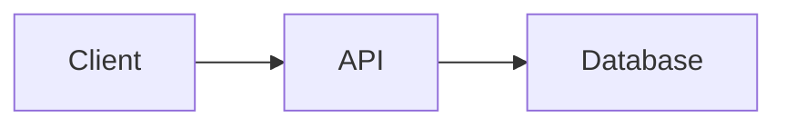

# Using spytial-gdl

Use this guide to create a graph diagram or convert a Mermaid flowchart and
embed it in a project. Read the existing graph and the project's page or docs
setup before making changes.

spytial-gdl renders nodes and edges with explicit spatial rules. It supports
trees, dependencies, architecture graphs, and relationship diagrams. It does
not implement Mermaid's sequence, Gantt, pie, or state-diagram syntax.

## Convert a Mermaid flowchart

1. Preserve node IDs, display labels, edges, and edge direction. Expand chained
   edges into one edge per line.
2. Use `A[Label] -> B[Other label]`. Basic Mermaid `-->` arrows and
   `A -->|relation| B` labels also work.
3. Remove the `graph` or `flowchart` header. Translate its direction into
   `@orientation(selector=_links, directions=[right])` for LR, `[left]` for RL,
   `[below]` for TD or TB, and `[above]` for BT.
4. Use an edge's relation name as a selector only when it describes that
   relationship. Relation, type, and class names use letters, digits, and
   underscores, cannot start with a digit or underscore, and must avoid query
   keywords. An unlabeled edge needs no invented relation name.
5. Edge labels containing spaces or punctuation cannot be preserved verbatim
   as relation names. Propose a valid identifier, record the original wording
   in a comment, and explain the visible label change. If exact visible wording
   is required, report that limitation. Keep different relationships distinct.
6. Convert simple subgraphs to classes and `@group` rules. For example,
   `class api,db backend` with `@group(selector=backend, name='Backend')`.
   Use different names for relations, types, and classes.
7. Shape syntax and arrow styles do not retain their Mermaid appearance.
   `classDef` is ignored. Consult the references below to translate styling,
   and explain any unsupported feature instead of silently dropping it.
8. Use the `spytial-gdl` fence or HTML container and install the renderer as
   described below. Changing the fence alone does not install it.

For example, this Mermaid graph:



becomes:

```spytial-gdl
client[Client] -> api[API]
api -> db[Database]

@orientation(selector=_links, directions=[right])
```

A direction rule applies to every selected edge. If the graph contains a cycle,
a single direction on all its edges is impossible. Retain the cycle and choose
rules for specific relations, or use a cyclic layout when that is appropriate.

## Embed it

For an HTML page, this is a complete starting point:

```html
<!doctype html>
<html lang="en">
<meta charset="utf-8">
<meta name="viewport" content="width=device-width, initial-scale=1">
<title>Graph</title>
<div class="spytial-gdl" data-height="360">
client[Client] -> api[API]
api -> db[Database]

@orientation(selector=_links, directions=[right])
</div>
<script type="module" src="https://cdn.jsdelivr.net/npm/spytial-gdl/src/auto.js"></script>
</html>
```

Serve the page over HTTP using the project's existing preview command.
Opening it as a `file://` URL does not support this module setup.
The script loads the rendering engine from a CDN and finds diagram blocks.
A host with a restrictive content security policy may need self-hosted assets;
follow the embedding reference for that setup.

For Markdown, add the script once to the site template or documentation
framework, then write a fenced block with the language `spytial-gdl`.
Use the platform reference for the actual framework in the project. Keep the
Mermaid renderer if other diagrams still use it. GitHub README pages do not
run this script; link to a hosted page or playground for the live diagram.

## Add spatial rules

Start with the few rules needed to express the intended layout. These are valid
examples; replace selectors with names from the graph:

```text
@orientation(selector=child, directions=[below])
@align(selector=sibling, direction=horizontal)
@cyclic(selector=next, direction=clockwise)
@group(selector=backend, name='Backend')
@atomStyle(selector=Service, fillStyle(color='#eef6ff'))
@edgeStyle(field=calls, lineStyle(pattern=dashed))
```

`_links` selects all edges. Types such as `api[API]:::Service` and classes
such as `class api,db backend` select sets of nodes. Orientation and alignment
operate on edges; grouping and node styling operate on nodes.
`edgeStyle` selects an edge relation with `field=`, not `selector=_links`.

Consult the annotation reference for other rules and their arguments.
Read the [language manifest](https://www.siddharthaprasad.com/spytial-gdl/spytial-gdl-language.json)
for the compiler's annotation arguments and allowed values. Its
`upstream.selectorManifest` points to the selector expression language.
The manifest lists canonical graph forms, not every accepted Mermaid spelling.

## Check the result

- Compare the converted nodes, edges, directions, and labels with the input.
- Open the page through the project's preview server and verify that it renders
  a diagram, not just a code block.
- Check parser diagnostics, engine errors, and constraint conflicts. Resolve
  them or explain the specific remaining issue.
- Drag a node and check the intended spatial relationships.
- Return the changed file paths and the preview or hosted URL. If rendering
  could not be checked, say so.

## References

These links return Markdown directly and can be read without a browser:

- [Notation and Mermaid compatibility](https://www.siddharthaprasad.com/spytial-gdl/docs/pages/notation.md)
- [Annotations and styling](https://www.siddharthaprasad.com/spytial-gdl/docs/pages/annotations.md)
- [Embedding and API](https://www.siddharthaprasad.com/spytial-gdl/docs/pages/embedding.md)
- [Platform setup](https://www.siddharthaprasad.com/spytial-gdl/docs/pages/platforms.md)
- [Playground](https://www.siddharthaprasad.com/spytial-gdl/playground/)

## Working on this repository

This repository owns notation, parsing, serialization, Markdown and HTML
embedding, and documentation. Fundamental layout semantics belong in
`spytial-core`.

Run the smallest relevant test for a change. Use `npm test` for broad changes
and `npm run serve` to preview the static site. Do not edit generated artifacts.
