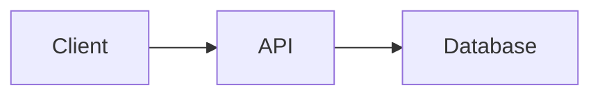

# Convert Mermaid and Graphviz graphs

Spytial-GDL supports graph diagrams. It does not implement Mermaid's sequence,
Gantt, pie, or state-diagram syntax. DOT is not accepted as input; translate it
before rendering.

## Mermaid flowcharts

1. Preserve node IDs, display labels, edges, and edge direction. Expand chained
   edges into one edge per line.
2. Use `A[Label] -> B[Other label]`. Basic Mermaid `-->` arrows and
   `A -->|relation| B` labels also work.
3. Remove the `graph` or `flowchart` header. Translate its direction into
   `@orientation(selector=_links, directions=[right])` for LR, `[left]` for RL,
   `[below]` for TD or TB, and `[above]` for BT.
4. Use an edge's relation name as a selector only when it describes that
   relationship. Relation, type, and class names use letters, digits, and
   underscores, cannot start with a digit or underscore, and must avoid query
   keywords. An unlabeled edge needs no invented relation name.
5. Edge labels containing spaces or punctuation cannot be preserved verbatim
   as relation names. Propose a valid identifier, record the original wording
   in a comment, and explain the visible label change. If exact visible wording
   is required, report that limitation. Keep different relationships distinct.
6. Convert simple subgraphs to classes and `@group` rules. For example,
   `class api,db backend` with `@group(selector=backend, name='Backend')`.
   Use different names for relations, types, and classes.
7. Shape syntax and arrow styles do not retain their Mermaid appearance.
   `classDef` is ignored. Consult [Requirements](annotations.md) to translate styling,
   and explain any unsupported feature instead of silently dropping it.
8. Use the `spytial-gdl` fence or HTML container and install the renderer using
   [Embedding and API](embedding.md) and the relevant [platform recipe](platforms.md).
   Changing the fence alone does not install it.

For example, this Mermaid graph:



becomes:

```spytial-gdl
client[Client] -> api[API]
api -> db[Database]

@orientation(selector=_links, directions=[right])
```

A direction rule applies to every selected edge. If the graph contains a cycle,
a single direction on all its edges is impossible. Retain the cycle and choose
rules for specific relations, or use a cyclic layout when that is appropriate.

## Graphviz DOT graphs

This is a source translation, not a compatible renderer for DOT. Read the
[DOT language reference](https://graphviz.org/doc/info/lang.html) when needed.

- For a directed graph, turn each `a -> b` edge into a GDL edge on its own line.
  Preserve isolated nodes too. Expand chains and subgraph edge shorthand into
  their actual edges before translating.
- Translate node `label` attributes to `id[Display label]`. Remap identifiers
  that GDL cannot represent to stable valid IDs and keep a mapping. HTML-like
  labels, record fields, ports, and arbitrary quoted labels are not equivalent
  to GDL labels; explain losses and ask if exact preservation is required.
- Translate simple edge labels into relation names only when they are valid
  identifiers. Apply the label restrictions in the Mermaid instructions above.
- Treat `rankdir` as a global layout preference, not proof of a semantic ordering.
  Add an orientation rule only if that ordering is intended and consistent with
  the graph. Do not force every edge of a cycle in the same direction.
- Recreate meaningful clusters with classes and `@group`. Translate supported
  styles explicitly. Do not assume that ranks, ports, coordinates, shapes,
  nested clusters, or Graphviz layout algorithms carry over.
- Undirected edges and parallel edges need particular care. Do not invent a
  semantic direction for `--` or collapse distinct edges without explaining
  the change. Report unsupported cases before presenting the conversion as
  equivalent.

## Verify the conversion

Compare nodes, labels, edges, and directions with the input, including isolated
nodes. Check parser diagnostics and layout conflicts. For an embedded result,
open the page through its preview server and drag a node to check the intended
spatial relationships. Explain any remaining losses or checks you could not run.

See [Embedding and API](embedding.md) to integrate the result. GitHub README
files and PR descriptions cannot run the renderer; provide a hosted live link,
optionally with an exported image.
