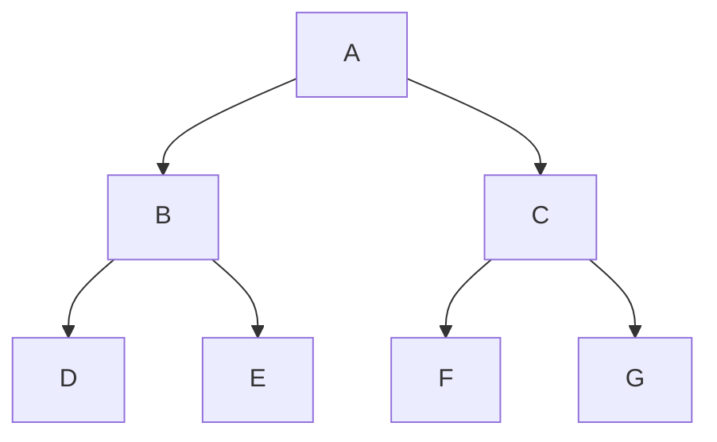

# Introduction

*Diagramming in your browser, with semantics.*

**spytial-graph** is a small text notation for a graph with its *layout written
inline*. You write nodes, edges, and spatial operations as `@annotations`; SpyTial
solves the layout and draws a live, draggable diagram. Drop a fenced
` ```spytial-graph ` block into Markdown and it comes alive client-side, the way
` ```mermaid ` does — no build step, no server beyond static hosting.

```spytial-graph
A -> B : left
A -> C : right
B -> D : left
B -> E : right
C -> F : left
C -> G : right

@orientation(selector=_links, directions=[below])
@orientation(selector=left,  directions=[left])
@orientation(selector=right, directions=[right])
```

You get a faithful default layout for free; the `@annotations` refine it —
orientation, alignment, grouping, cycles — without rebuilding anything. The block
above is the whole input. Drag a node and the constraints re-settle around it.

## Why not just a flowchart?

A flowchart language draws a *picture* of a graph. It does not know what the graph
*means*: that these edges are "left child" and "right child", that the layout
should reflect that, that a node is a `Person` and not a `Company`. Here is the
same binary tree as a Mermaid flowchart — perfectly readable, but the directions
are a hand-placed accident of `TD`, not a stated rule:



In spytial-graph the edge label **is** a relation, and the relation is what the
layout rule targets: `@orientation(selector=left, directions=[left])` says *every
`left` edge points its child to the left* — a fact about the model, not about this
drawing. Change the data and the meaning carries over. That difference is the whole
idea; the essay [Your diagram doesn't know what it's
drawing](../examples/md-viewer.html?doc=your-diagram-doesnt-know.md) walks through it.

## What you can build

A node's identity, type, and class are all addressable, so layout and styling are
*queries over the model*, not per-node markup:

```spytial-graph
alice[Alice]:::Person -> acme[Acme]:::Company
bob[Bob]:::Person     -> acme
carol[Carol]:::Person -> acme

@orientation(selector=_links, directions=[left])
@atomColor(selector=Person, value='#cfe8d8')
@atomColor(selector=Company, value='#ffe7b3')
@group(selector=Person, name='People')
```

## When constraints conflict

You can over-constrain a layout. When the rules can't all hold, nothing silently
disappears: SpyTial draws the closest feasible diagram **and** reports the minimal
set of rules in conflict (the UNSAT core). Try it — this one asks two edges to go
in opposite incompatible directions:

```spytial-graph
A -> B : x
B -> A : y

@orientation(selector=x, directions=[right])
@orientation(selector=y, directions=[right])
```

See [Conflicts & UNSAT](conflicts.md) for how to read that panel.

## Where to go next

- **[Getting started](getting-started.md)** — the one-tag drop-in and your first diagram.
- **[The notation](notation.md)** — nodes, edges, labels, sorts, classes.
- **[Annotations](annotations.md)** — every spatial constraint and styling directive.
- **[Programmatic API](api.md)** — drive the renderer from JavaScript.
- **[Editable diagrams](editable.md)** — the `text → visual → edit → text` round-trip.

> **Note** — Every diagram on this site is live. The docs are themselves a
> spytial-graph instance: each example is the exact notation you'd write, rendered
> by the same engine you'd embed. View source on any block via its **Source** panel.
