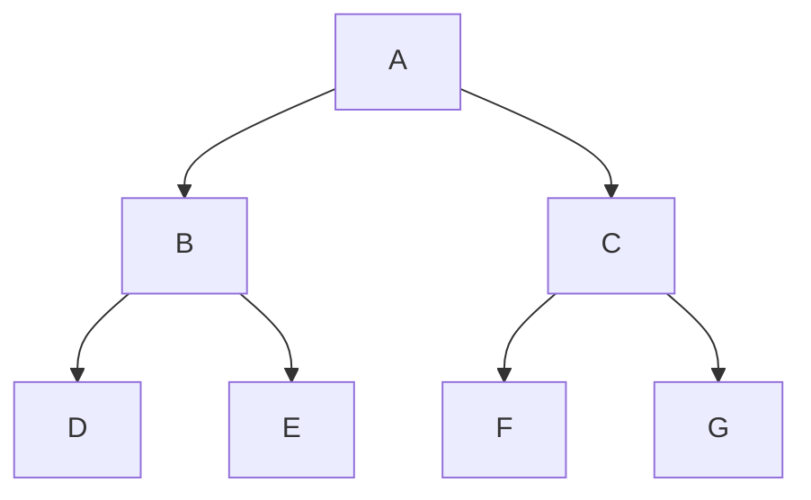

# Introduction

*Diagramming in your browser, with semantics.*

**spytial-gdl** is a small **graph description language (GDL)**: a text notation
for a graph with its *layout written inline*. You write nodes, edges, and spatial operations as `@annotations`; Spytial
solves the layout and draws a live, draggable diagram. Drop a fenced
` ```spytial-gdl ` block into Markdown and it comes alive client-side, the way
` ```mermaid ` does — no build step, no server beyond static hosting.

```spytial-gdl
A -> B : left
A -> C : right
B -> D : left
B -> E : right
C -> F : left
C -> G : right

@orientation(selector=_links, directions=[below])
@orientation(selector=left,  directions=[left])
@orientation(selector=right, directions=[right])
```

You get a faithful default layout for free; the `@annotations` refine it —
orientation, alignment, grouping, cycles — without rebuilding anything. The block
above is the whole input. Drag a node and the constraints re-settle around it.

## Why not just a flowchart?

A flowchart language draws a *picture* of a graph. It does not know what the graph
*means*: that these edges are "left child" and "right child", that the layout
should reflect that, that a node is a `Person` and not a `Company`. Here is the
same binary tree as a Mermaid flowchart — perfectly readable, but the directions
are a hand-placed accident of `TD`, not a stated rule:



In spytial-gdl the edge label **is** a relation, and the relation is what the
layout rule targets: `@orientation(selector=left, directions=[left])` says *every
`left` edge points its child to the left* — a fact about the model, not about this
drawing. Change the data and the meaning carries over. That difference is the whole
idea; the essay [Your diagram doesn't know what it's
drawing](../examples/md-viewer.html?doc=your-diagram-doesnt-know.md) walks through it.

## What you can build

A node's identity, type, and class are all addressable, so layout and styling are
*queries over the model*, not per-node markup:

```spytial-gdl
alice[Alice]:::Person -> acme[Acme]:::Company
bob[Bob]:::Person     -> acme
carol[Carol]:::Person -> acme

@orientation(selector=_links, directions=[left])
@atomStyle(selector=Person, borderStyle(color='#cfe8d8'))
@atomStyle(selector=Company, borderStyle(color='#ffe7b3'))
@group(selector=Person, name='People')
```

## When constraints conflict

You can over-constrain a layout. When the rules can't all hold, nothing silently
disappears: Spytial draws the closest feasible diagram **and** reports the minimal
set of rules in conflict (the UNSAT core). Try it — this one asks two edges to go
in opposite incompatible directions:

```spytial-gdl
A -> B : x
B -> A : y

@orientation(selector=x, directions=[right])
@orientation(selector=y, directions=[right])
```

See [Errors and conflicts](annotations.md#errors-and-conflicts) for how to read that panel.

## The 30-second drop-in

Add one line to any page that renders your Markdown (or to a hand-written HTML
page). Everything loads from CDN — there is no `npm install` and no build step:

```html
<script type="module" src="https://cdn.jsdelivr.net/npm/spytial-gdl/src/auto.js"></script>
```

Then write a fenced block the way you'd write `mermaid`:

````markdown
```spytial-gdl
A -> B
B -> C
@orientation(selector=_links, directions=[right])
```
````

Every `spytial-gdl` block on the page becomes a live diagram. The script pulls
in the renderer (d3, WebCola, spytial-core) for you if the page doesn't already
load it. The result:

```spytial-gdl
A -> B
B -> C
@orientation(selector=_links, directions=[right])
```

## In plain HTML (no Markdown renderer)

You don't need Markdown at all. In a hand-written page, put the notation in a
`<div class="spytial-gdl">` and add the same one tag — the way you'd drop a
`<div class="mermaid">` into a page. A complete, runnable page:

```html
<!DOCTYPE html>
<meta charset="utf-8" />
<style>.spytial-gdl { height: 340px; }</style>

<div class="spytial-gdl">
  A -> B : left
  A -> C : right

  @orientation(selector=_links, directions=[below])
  @orientation(selector=left,  directions=[left])
  @orientation(selector=right, directions=[right])
</div>

<script type="module" src="https://cdn.jsdelivr.net/npm/spytial-gdl/src/auto.js"></script>
```

On load, every block becomes a live diagram — no init call, no config. The block
also accepts `class="language-spytial-gdl"` and `<pre class="spytial-gdl">`,
so whatever markup you (or a renderer) emit is caught. Indentation inside the
`<div>` is fine; each line is trimmed.

> **Renaming note** — This project was previously called `spytial-graph`. The old
> ` ```spytial-graph ` fence tag (and `spytial` for short) still renders, so pages
> and embeds written before the rename keep working. New content should use
> ` ```spytial-gdl `.

> **Note** — The page must be **served** (any static server) rather than opened as
> `file://`, because the tag is an ES module. See *Running locally* below.

## Wiring it yourself

If you'd rather control timing, height, or theme, import `autoRender` instead of
the drop-in tag:

```html
<script type="module">
  import { autoRender } from 'https://cdn.jsdelivr.net/npm/spytial-gdl/src/markdown.js';
  autoRender({ height: 420, theme: 'dark' });
</script>
```

Or render a specific subtree after you inject HTML yourself — see
[Markdown & HTML embedding](embedding.md) for the full surface.

## Give each block a height

The diagram fills its container, so a block needs a height:

```css
.spytial-gdl, .spytial-gdl-editable { height: 340px; }
```

A single block can override it with `data-height` (a number of pixels or any CSS
length), or set a default for the page with `autoRender({ height })`.

## Running locally

Clone the repo and start the zero-dependency static server:

```bash
npm run serve   # serves the repo on http://localhost:8100
```

Then open:

| URL | what it is |
|---|---|
| `/docs/` | this documentation site |
| `/playground/` | live editor (View ⇄ Edit) |
| `/examples/` | every embedding mode, runnable |

Any static server works — one is needed only because the pages load ES modules.

## Pinning versions for production

The CDN URLs above always fetch the latest published `spytial-gdl` and, through
it, a pinned `spytial-core`. For a reproducible deploy, vendor the three engine
scripts locally (d3 v4, `webcola@3.4.0`, `spytial-core`) and point the tag at your
own copy — see [Architecture](architecture.md#dependencies) for the exact set and
load order.

## Next

- **[The notation](notation.md)** — write the graph.
- **[Annotations](annotations.md)** — write the layout.
- **[Embedding & API](embedding.md)** — drop it into a page, or drive it from JavaScript.

> **Note** — Every diagram on this site is live. The docs are themselves a
> spytial-gdl instance: each example is the exact notation you'd write, rendered
> by the same engine you'd embed. View source on any block via its **Source** panel.
