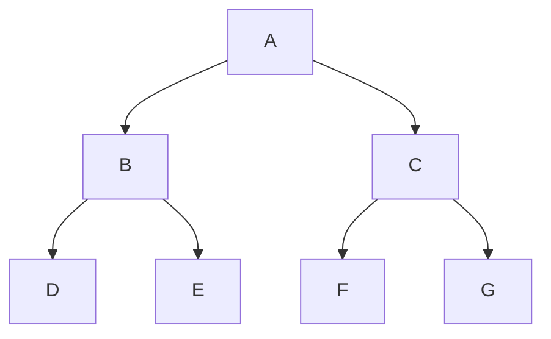

# Introduction

What spytial-gdl is, and how to get a diagram onto a page.

**spytial-gdl** is a small graph description language: a text notation for a graph
with its layout written inline. You write nodes, edges, and spatial operations as
`@annotations`, then Spytial solves the layout and draws a live, draggable diagram.
Drop a fenced ` ```spytial-gdl ` block into Markdown and it renders client-side the
way a ` ```mermaid ` block does, with no build step and no server beyond static
hosting.

```spytial-gdl
A -> B : left
A -> C : right
B -> D : left
B -> E : right
C -> F : left
C -> G : right

@orientation(selector=_links, directions=[below])
@orientation(selector=left,  directions=[left])
@orientation(selector=right, directions=[right])
```

That block is the whole input. Spytial will lay out any graph without help; the
`@annotations` are how you say what the arrangement should mean. Orientation,
alignment, grouping, and cycles are all annotations, and none of them ask you to
change the graph. Drag a node and the constraints re-settle around it.

## Why not just a flowchart?

A flowchart language draws a picture of a graph. It doesn't record what the graph
means: that these edges are "left child" and "right child", that the layout should
follow from that, that a node is a `Person` rather than a `Company`. Here is the
same binary tree in Mermaid. It reads fine, but the left-right arrangement comes
out of `TD` and the order the lines happen to be in, not out of anything the source
says.


```mermaid
flowchart TD
  A --> B
  A --> C
  B --> D
  B --> E
  C --> F
  C --> G
```

In spytial-gdl the edge label is the relation name, and the relation is what a
layout rule targets. `@orientation(selector=left, directions=[left])` says that
every `left` edge puts its child on the left, which is a claim about the model
rather than about this drawing, so it survives a change to the data. The essay
[Your diagram doesn't know it's a family
tree](../examples/md-viewer.html?doc=your-diagram-doesnt-know.md) works through a
longer version of the same argument.

## Scope

The notation covers graphs only: nodes, edges, labels, types, and classes. There is
no syntax for sequence, state, Gantt, or pie diagrams. An edge label is a relation
name rather than free text.

## Types and classes

A node carries an id, an optional type, and any number of classes. All three can be
named by a selector, so a rule applies to whatever matches it instead of to nodes
you picked out by hand:

```spytial-gdl
alice[Alice]:::Person -> acme[Acme]:::Company
bob[Bob]:::Person     -> acme
carol[Carol]:::Person -> acme

@orientation(selector=_links, directions=[left])
@atomStyle(selector=Person, borderStyle(color='#cfe8d8'))
@atomStyle(selector=Company, borderStyle(color='#ffe7b3'))
@group(selector=Person, name='People')
```

## When constraints conflict

You can over-constrain a layout. When the rules can't all hold, Spytial draws the
closest feasible diagram and reports the smallest set of rules that are in conflict
(the UNSAT core). Nothing is dropped quietly. The block below asks two edges of a
2-cycle to both point right, which is impossible:

```spytial-gdl
A -> B : x
B -> A : y

@orientation(selector=x, directions=[right])
@orientation(selector=y, directions=[right])
```

[Errors and conflicts](annotations.md#errors-and-conflicts) explains how to read
that panel.

## Adding it to a page

Add one line to whatever renders your Markdown, or to a hand-written HTML page.
Everything loads from a CDN, so there is no `npm install` and no build step:

```html
<script type="module" src="https://cdn.jsdelivr.net/npm/spytial-gdl/src/auto.js"></script>
```

Then write a fenced block the way you'd write `mermaid`:

````markdown
```spytial-gdl
A -> B
B -> C
@orientation(selector=_links, directions=[right])
```
````

Every `spytial-gdl` block on the page becomes a live diagram. The script pulls in
the renderer (d3, WebCola, spytial-core) if the page doesn't already load it. The
result:

```spytial-gdl
A -> B
B -> C
@orientation(selector=_links, directions=[right])
```

## Without a Markdown renderer

You don't need Markdown at all. In a hand-written page, put the notation in a
`<div class="spytial-gdl">` and add the same tag, the way you'd drop in a
`<div class="mermaid">`. A complete, runnable page:

```html
<!DOCTYPE html>
<meta charset="utf-8" />
<style>.spytial-gdl { height: 340px; }</style>

<div class="spytial-gdl">
  A -> B : left
  A -> C : right

  @orientation(selector=_links, directions=[below])
  @orientation(selector=left,  directions=[left])
  @orientation(selector=right, directions=[right])
</div>

<script type="module" src="https://cdn.jsdelivr.net/npm/spytial-gdl/src/auto.js"></script>
```

Every block becomes a live diagram on load. You don't call an init function or pass
any config. `class="language-spytial-gdl"` and `<pre class="spytial-gdl">` are
picked up too, so whatever markup you or a renderer emit gets caught. Indentation
inside the `<div>` is fine, since each line is trimmed.

> **Renaming note.** This project used to be called `spytial-graph`. The old
> ` ```spytial-graph ` fence tag (and `spytial` for short) still renders, so pages
> and embeds written before the rename keep working. New content should use
> ` ```spytial-gdl `.

> **Note.** The page has to be served by a static server rather than opened as
> `file://`, because the tag is an ES module. See *Running locally* below.

## Calling autoRender yourself

To control timing, height, or theme, import `autoRender` instead of using the
drop-in tag:

```html
<script type="module">
  import { autoRender } from 'https://cdn.jsdelivr.net/npm/spytial-gdl/src/markdown.js';
  autoRender({ height: 420, theme: 'dark' });
</script>
```

You can also render one subtree after injecting HTML yourself. See
[Markdown & HTML embedding](embedding.md) for the full surface.

## Give each block a height

The diagram fills its container, so a block needs a height:

```css
.spytial-gdl, .spytial-gdl-editable { height: 340px; }
```

A single block overrides that with `data-height` (a number of pixels or any CSS
length), and `autoRender({ height })` sets a default for the page.

## Running locally

Clone the repo and start the zero-dependency static server:

```bash
npm run serve   # serves the repo on http://localhost:8100
```

Then open:

| URL | what it is |
|---|---|
| `/docs/` | this documentation site |
| `/playground/` | live editor (View ⇄ Edit) |
| `/examples/` | every embedding mode, runnable |

Any static server works. One is needed only because the pages load ES modules.

## Pinning versions for production

The CDN URLs above always fetch the latest published `spytial-gdl`, and through it
a pinned `spytial-core`. For a reproducible deploy, vendor the three engine scripts
locally (d3 v4, `webcola@3.4.0`, `spytial-core`) and point the tag at your own copy.
[Architecture](architecture.md#dependencies) lists the exact set and load order.

## Next

- [The notation](notation.md): nodes, edges, labels, types, classes.
- [Annotations](annotations.md): the `@` operations that produce the layout.
- [Embedding & API](embedding.md): putting a diagram in a page, or driving it from JavaScript.

> **Note.** Every diagram on this site is live. Each example is the exact notation
> you'd write, rendered by the engine you'd embed. Open a block's **Source** panel
> to see it.
