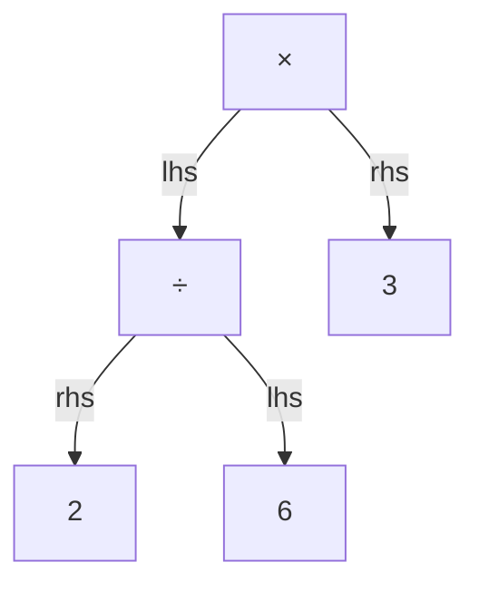

# Lightweight Interactive Diagrams in the Browser (with Semantics!)

Technical diagrams were once largely hand-maintained artifacts: drawing files or
exported images kept alongside, but separate from, the prose and systems they
explained. Text-based graph description languages changed that relationship.
A DOT graph or Mermaid block can be checked into a repository, embedded in
technical prose, and regenerated as part of a build or browser render pipeline.
All authors have to write is a lightweight description of graph structure; the
graph description language deals with drawing and layout. The result is portable,
version-controlled, easy to revise, and cheap to keep synchronized with
surrounding text and code.

Effective diagrams, however, use space to make structure perceptible. That space
often carries semantic weight. Consider a parse tree for the arithmetic
expression `(6 ÷ 2) × 3`:


```mermaid
flowchart TD
  mul[×] -->|lhs| div[÷]
  mul -->|rhs| three[3]
  div -->|rhs| two[2]
  div -->|lhs| six[6]
```

In an expression tree, `lhs` and `rhs` are not just edge labels. They determine
which operand comes first in a non-commutative operation such as division.
Mermaid preserves those labels as text, but its graph layout has no notion of
their expression-tree meaning. A right operand can appear to the left of a left
operand. The picture can then suggest `2 ÷ 6`, despite its labels saying
`6 ÷ 2`.

Diagram authors employ a variety of tricks to steer layout: invisible edges,
ranks, subgraphs, and changes to the order of the source. But these techniques
are often specific to the exact graph being laid out and must be reworked when
the underlying graph changes. The description now contains not only the
structure of the actual graph, but also graph elements that exist only to
influence layout.

spytial-gdl pairs the node-and-edge description with spatial requirements.
When spatial arrangement is incidental, write only the graph. When a spatial
relationship matters, add the requirements needed to express it. Readers can
then drag elements into positions that continue to satisfy those requirements.

## Drawing an expression

Here is the same arithmetic expression in spytial-gdl. The program pairs the
graph description with two requirements: every `lhs` child should sit below-left
of its parent and every `rhs` child below-right.

```spytial-gdl
mul[×] -> div[÷] : lhs
mul -> three[3] : rhs
div -> six[6] : lhs
div -> two[2] : rhs

@orientation(selector=lhs, directions=[below, left])
@orientation(selector=rhs, directions=[below, right])
```

Try dragging an operator or a number. Open **Source** to see the program that
produced this diagram.

Each requirement has three parts. The type of requirement, here
`@orientation`, says how the spatial relationship is constrained. The selector
says which graph elements it applies to, here every edge labeled `lhs` or
`rhs`. The directions say where the selected child should appear relative to
its parent.

The author does not specify coordinates or distances. The requirements describe
a set of acceptable layouts rather than one fixed drawing. Readers can drag
nodes within that set, with Spytial preserving the relationships the requirements
describe.

Reordering the graph edges, reordering the requirements, or adding a new operator
does not change their meaning. As long as the graph contains `lhs` and `rhs`
edges, the same requirements govern them.

The [spatial vocabulary](annotations.md) also includes alignment, grouping, and
cyclic arrangements. You can place related elements along an axis, enclose them
in a box, or arrange them around a cycle.

## When requirements conflict

Suppose the graph also has an edge from `div` back to `mul`, so multiplication
and division are each an operand of the other. The graph is no longer a
well-formed expression tree. A graph renderer can draw it anyway; the reader
must notice that the picture is not a tree, and in a larger diagram they may not.

```spytial-gdl
mul[×] -> div[÷] : lhs
mul -> three[3] : rhs
div -> six[6] : lhs
div -> two[2] : rhs
div -> mul : rhs

@orientation(selector=lhs, directions=[below, left])
@orientation(selector=rhs, directions=[below, right])
```

The orientation rules require multiplication to be both above and below
division, which cannot hold. Spytial reports the implicated diagram elements
and requirements. The displayed layout relaxes requirements so you can inspect
the graph. Such a drawing helps explain the conflict; it does not satisfy the
original requirements.

## Editing the expression

A rendered diagram can also be an editable view of its graph description.
This version lets you change the graph directly:

```spytial-gdl-editable
mul[×] -> div[÷] : lhs
mul -> three[3] : rhs
div -> six[6] : lhs
div -> two[2] : rhs
eleven[11]

@orientation(selector=lhs, directions=[below, left])
@orientation(selector=rhs, directions=[below, right])
```

Move the end of division's `lhs` edge from `6` to `11`. The source updates,
and the layout places `11` below-left of division. The old operand remains in
the graph, now disconnected.

The requirements continue to guide the drawing as you edit. If an edit makes
them impossible to satisfy, Spytial reports the conflict. You can also edit the
source and press **Run** to update the diagram.

## Beyond the drawing

Because the graph and requirements remain available in the browser, Spytial can
distinguish relationships required by the source from those that merely appear
in the current drawing.

That distinction matters for other ways of accessing a diagram. A description
of the current picture answers where an operand is now. It does not necessarily
answer whether that operand must stay on the left, or which requirement puts it
there. The graph and requirements provide a basis for textual, assistive, and
query-based views. A complete assistive interface is still future work.

## Use it in your page

Add this script once to your HTML page or Markdown site's template:

```html
<script type="module" src="https://cdn.jsdelivr.net/npm/spytial-gdl/src/auto.js"></script>
```

Put the source in a `spytial-gdl` Markdown fence, or inside
`<div class="spytial-gdl">` in HTML. For the editable version, use
`spytial-gdl-editable`. The script loads spytial-core's complete browser bundle
and renders each block in a 360px frame with compact graph controls. Set
`data-height` on a block to adjust its frame, or follow the
[author's appearance guide](embedding.md#choose-how-your-diagrams-appear) to
choose a theme and controls. Serve the page over HTTP; this module setup cannot
run from a `file://` URL. GitHub README pages display the source only.

[Open the playground](../playground/), [copy an HTML example](../examples/drop-in.html),
or follow the [setup for your docs site](platforms.md).
If you already have a Mermaid flowchart, give it to your agent with
[the conversion guide](conversion.md).

For the language itself, see the [syntax reference](notation.md),
[requirements](annotations.md), and [embedding API](embedding.md).

*Adapted from “Lightweight Interactive Diagrams in the Browser (with Semantics!)”
by Siddhartha Prasad, Tim Nelson, and Shriram Krishnamurthi.*
