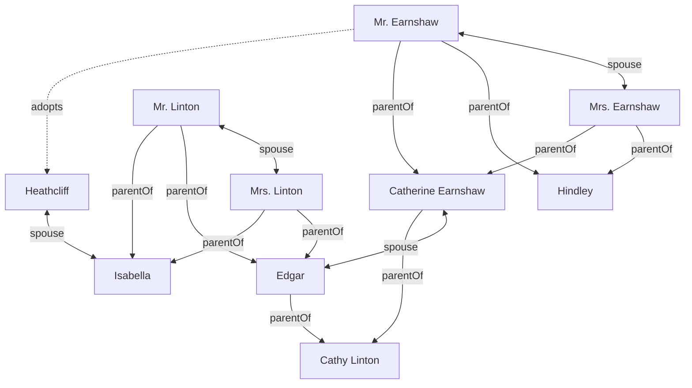

# Your diagram doesn't know it's a family tree

I picked up *Wuthering Heights* again recently and, as usual, lost track of who
was who. Two houses, two generations of Earnshaws and Lintons, a foundling who
marries into both, and, because Brontë shows no mercy, a mother and daughter who
share a name. Somewhere around the second Catherine I gave up and did what
anyone would do: I went to draw the family tree.

(Actually, the audiobook. Same problem.)

I immediately reached for Mermaid, which is a tool I find useful. The source
lives with the text, changes in a diff, and renders where the reader already is;
that bargain is still a little miraculous. The source looks like a genealogy:



But look at what that source actually tells the renderer: draw a graph
top-down. A genealogy is not just a graph. Generations are rows, spouses are
adjacent, and a child belongs below the pair. You and I read those facts into a
family tree, but the source never says them.

That gap is the point.

## A Diagram Of A Model

The fix is not a better flowchart. It is a different thing for the text to
describe.

> Mermaid has a model of a diagram. What I need is a diagram of a model.

Here are the Earnshaws, the Lintons, and Heathcliff in Spytial Graph:

<div class="spytial-gdl" data-height="600">
mr_e[Mr. Earnshaw]:::Earnshaw -> mrs_e[Mrs. Earnshaw]:::Earnshaw : spouse
mrs_e -> mr_e : spouse
mr_l[Mr. Linton]:::Linton -> mrs_l[Mrs. Linton]:::Linton : spouse
mrs_l -> mr_l : spouse

mr_e -> hindley[Hindley]:::Earnshaw : parentOf
mrs_e -> hindley : parentOf
mr_e -> catherine[Catherine Earnshaw]:::Earnshaw : parentOf
mrs_e -> catherine : parentOf
mr_e -> heathcliff[Heathcliff]:::Heathcliff : adopts

mr_l -> edgar[Edgar]:::Linton : parentOf
mrs_l -> edgar : parentOf
mr_l -> isabella[Isabella]:::Linton : parentOf
mrs_l -> isabella : parentOf

hindley -> frances[Frances]:::Earnshaw : spouse
frances -> hindley : spouse
catherine -> edgar : spouse
edgar -> catherine : spouse
heathcliff -> isabella : spouse
isabella -> heathcliff : spouse

hindley -> hareton[Hareton]:::Earnshaw : parentOf
frances -> hareton : parentOf
catherine -> cathy[Cathy Linton]:::Linton : parentOf
edgar -> cathy : parentOf
heathcliff -> linton[Linton Heathcliff]:::Heathcliff : parentOf
isabella -> linton : parentOf

cathy -> linton : spouse
linton -> cathy : spouse
cathy -> hareton : spouse
hareton -> cathy : spouse

@orientation(selector=parentOf, directions=[below])
@orientation(selector=adopts, directions=[below])
@align(selector=spouse, direction=horizontal)
@orientation(selector=Earnshaw->Linton, directions=[right])
</div>

The notation is small. `catherine`, `edgar`, and `heathcliff` are atoms.
`Earnshaw`, `Linton`, and `Heathcliff` are sorts. `spouse`, `parentOf`, and
`adopts` are named relations. Three lines carry the shape:

```text
@orientation(selector=parentOf, directions=[below])
@orientation(selector=adopts, directions=[below])
@align(selector=spouse, direction=horizontal)
```

Those are claims about relations, not hints about node IDs. Wherever `parentOf`
holds, the parent sits above the child. Wherever `spouse` holds, the partners
line up. The shape is a consequence of what the relations mean.

## You Assert; The System Arranges

Once the source carries a model, the work splits. You assert the facts: these
people, this `parentOf`, that `spouse`. You assert the spatial obligations:
parents above children, spouses aligned. Then you stop arranging boxes.

The system searches the space of layouts for one that satisfies what you said.
That also means it can refuse. The editable diagram below carries one extra
fact:

```text
cathy -> catherine : parentOf
```

That makes the daughter her own mother's parent. If `parentOf` always points
down, there is no arrangement where that can hold. The right answer is not a
cleverer drawing. It is that there isn't one.

<div class="spytial-gdl-editable" data-height="600">
mr_e[Mr. Earnshaw]:::Earnshaw -> mrs_e[Mrs. Earnshaw]:::Earnshaw : spouse
mrs_e -> mr_e : spouse
mr_l[Mr. Linton]:::Linton -> mrs_l[Mrs. Linton]:::Linton : spouse
mrs_l -> mr_l : spouse

mr_e -> hindley[Hindley]:::Earnshaw : parentOf
mrs_e -> hindley : parentOf
mr_e -> catherine[Catherine Earnshaw]:::Earnshaw : parentOf
mrs_e -> catherine : parentOf
mr_e -> heathcliff[Heathcliff]:::Heathcliff : adopts

mr_l -> edgar[Edgar]:::Linton : parentOf
mrs_l -> edgar : parentOf
mr_l -> isabella[Isabella]:::Linton : parentOf
mrs_l -> isabella : parentOf

hindley -> frances[Frances]:::Earnshaw : spouse
frances -> hindley : spouse
catherine -> edgar : spouse
edgar -> catherine : spouse
heathcliff -> isabella : spouse
isabella -> heathcliff : spouse

hindley -> hareton[Hareton]:::Earnshaw : parentOf
frances -> hareton : parentOf
catherine -> cathy[Cathy Linton]:::Linton : parentOf
edgar -> cathy : parentOf
heathcliff -> linton[Linton Heathcliff]:::Heathcliff : parentOf
isabella -> linton : parentOf

cathy -> catherine : parentOf

cathy -> linton : spouse
linton -> cathy : spouse
cathy -> hareton : spouse
hareton -> cathy : spouse

@orientation(selector=parentOf, directions=[below])
@orientation(selector=adopts, directions=[below])
@align(selector=spouse, direction=horizontal)
</div>

The Source panel is open because this is the editable version. Delete
`cathy -> catherine : parentOf`, hit **Run ▸**, and the report clears. Or drag
and edit the picture; the source rewrites itself. The point is not that the
diagram is interactive. The point is that the interaction still has a model
under it.

Mermaid made diagrams cheap enough to keep. Spytial Graph is an attempt to make
graph diagrams say enough to be worth trusting.

---

*The notation, source, and a playground are [on GitHub](https://github.com/sidprasad/spytial-gdl).*

<!-- This module turns every spytial-gdl block above into a live diagram. -->
<script type="module" src="../src/auto.js"></script>
